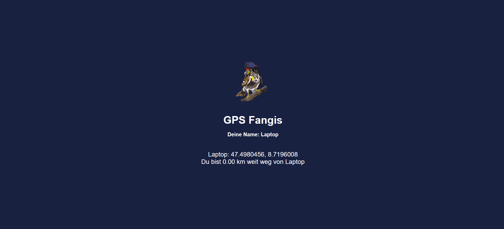

# GPS Fangis

Spiele Fangis via GPS in einem grossen Gelände.
Auf der Webseite wird einem der Standort angezeigt von allen die gerade auf der Webseite sind. Zudem wird berechnet wie viele Kilometer man von jemand anderen entfenrt ist. Mit diesem Hinweiss soll der Fänger die anderen fangen können.

Webseite unter: https://fangis.linoo.ch/

## Projekt auf Replit
Das Projekt basiert auf einem Express.js Server auf Replit. Für die Standortdaten wird die Replit DB verwendet.

## Projekt öffnen
1. Replit Projekt forken: https://replit.com/@surmatik/GPS-Fangis
2. Projekt auf Replit bearbeiten

## Voraussetzungen für User
- User muss die Standortberechtigung im Browser aktivieren
- User muss die Webseite auf dem Smartphone offen haben und darf den Browser nicht verlassen oder das Smartphone abschalten